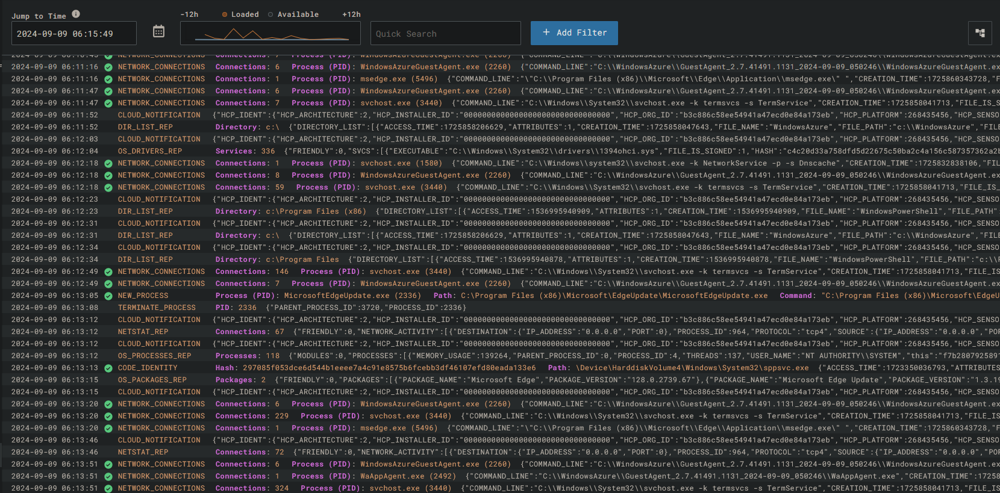
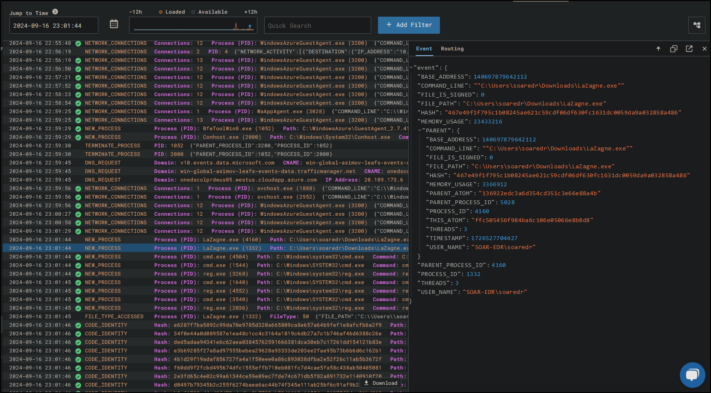

# 
 SOAR-EDR Project

## Introduction
This project demonstrates the implementation of a Security Orchestration, Automation, and Response (SOAR) solution integrated with Endpoint Detection and Response (EDR) using LimaCharlie and Tines, with alerts being sent to Slack. The project automates the detection and response process for potential security threats, providing real-time telemetry, alerts, and network isolation based on the playbook workflow.

## Key Components:
1. Playbook Workflow:
    - Detects suspicious activity and sends alerts via Slack and email.
    - Prompts the user with isolation options for the affected machine.
    - Automatically isolates the machine if instructed by the user.
2. LimaCharlie Setup:
    - Installation and configuration of LimaCharlie EDR on a virtual machine (Azure VM).
    - LimaCharlie is set up to monitor events in real-time, ensuring telemetry collection.

3. Telemetry Collection:
    - Uses the LaZagne password recovery tool to simulate an attack.
    - Detection and Response (D&R) rules are created in LimaCharlie to track and respond to the LaZagne process.

4. Slack & Tines Integration:
    - Configures Slack for alert notifications.
    - Establishes the connection between LimaCharlie and Tines using a webhook.
    - Verifies that alerts are sent to Slack upon detection of suspicious activity.

5. Automation:
    - Automation of playbook workflows using Tines, where security events trigger appropriate actions.
    - Automates the isolation of affected systems based on the user’s response in Slack or email.
