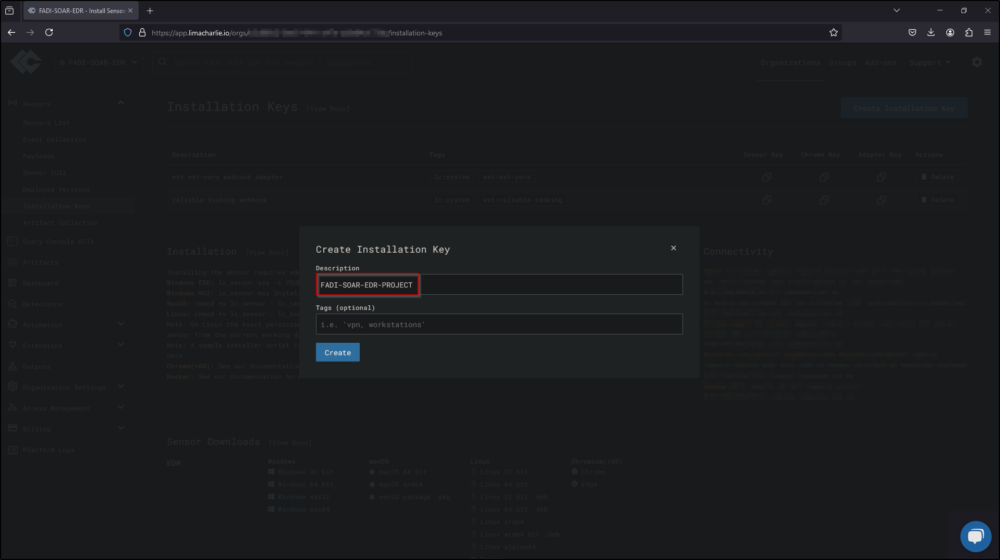

# 
 SOAR-EDR Project   Step-by-Step Implementation Guide

## Introduction
This document provides a comprehensive, step-by-step guide for deploying and configuring a Security Orchestration, Automation, and Response (SOAR) system integrated with Endpoint Detection and Response (EDR) using LimaCharlie, Slack, and Tines. The purpose of this guide is to help users implement a seamless detection and automated response workflow, enabling real-time monitoring, alerting, and machine isolation during potential security incidents.

The setup focuses on deploying a virtual environment, configuring the necessary EDR tools, generating telemetry, and integrating Slack for notifications and Tines for workflow automation. Each step is carefully outlined with detailed instructions and illustrations to ensure a successful implementation.

## Table of Contents

- Part 1: Diagram (playbook workflow)
- Part 2: LimaCharlie
- Part 3: Telemetry
- Part 4: Salck & Tines
- Part 5: Automation

## Step-by-Step Implementation Guide

### Step 1: Diagram
- Create playbook workflow
  - Send a Slack message containing information about the detection
  - Send an Email containing information about the detection
  - Generate a user prompt
    - Isolate the machine? (Yes/No)
    - If Yes – Isolate
   
Create playbook workflow

### Step 2: Deploy Virtual server and setup LimaCharlie

Deploy Server

Select create Azure virtual machine

Create new resource group 

Enter name for virtual machine

Select Region

Select Image 

Select virtual machine size

Enter a username and password

Select inbound ports and review and create

Select Create

RDP into new created vm

Visit limacharlie.io and create account and then select Create Organization

Create name for organization and select region then select Create Organization

Select Installation Keys

Select Create Installation Keys

Enter description name and select create

Remove all other installation keys 

Select Windows 64 bit sensor download and paste in windows vm browser to download EDR

Paste the link in URL and select enter to download

Copy sensor key from LimaCharlie

In windows vm open PowerShell as administrator

Navigate to downloads directory

Next, we will run the executable -i and paste our sensor key we copied and hit enter

Head over to services and search for LimaCharlie to verify successful installation

Navigate back to LimaCharlie and select sensors list and verify our computer name is displayed

Select the computer name and navigate to timeline to confirm LimaCharlie is generating events

### Step 3: Telemetry

