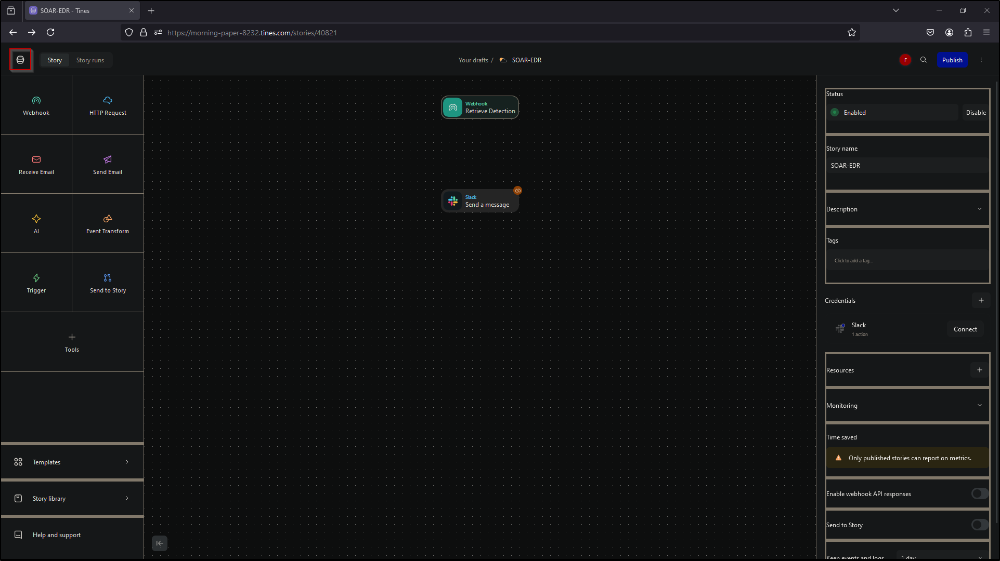
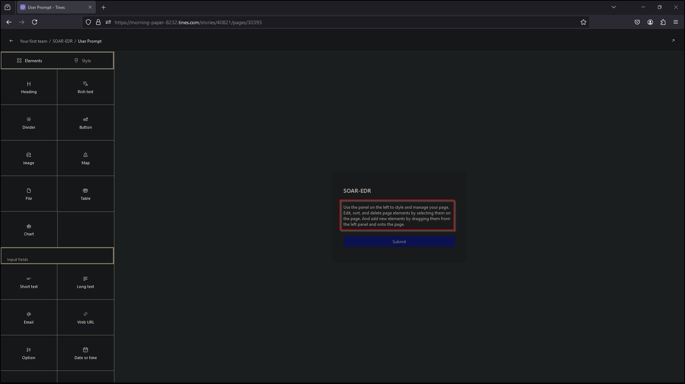
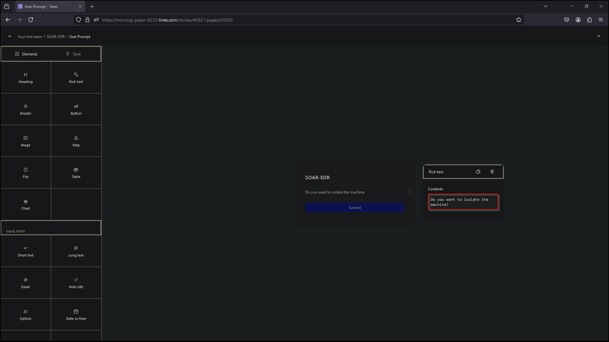
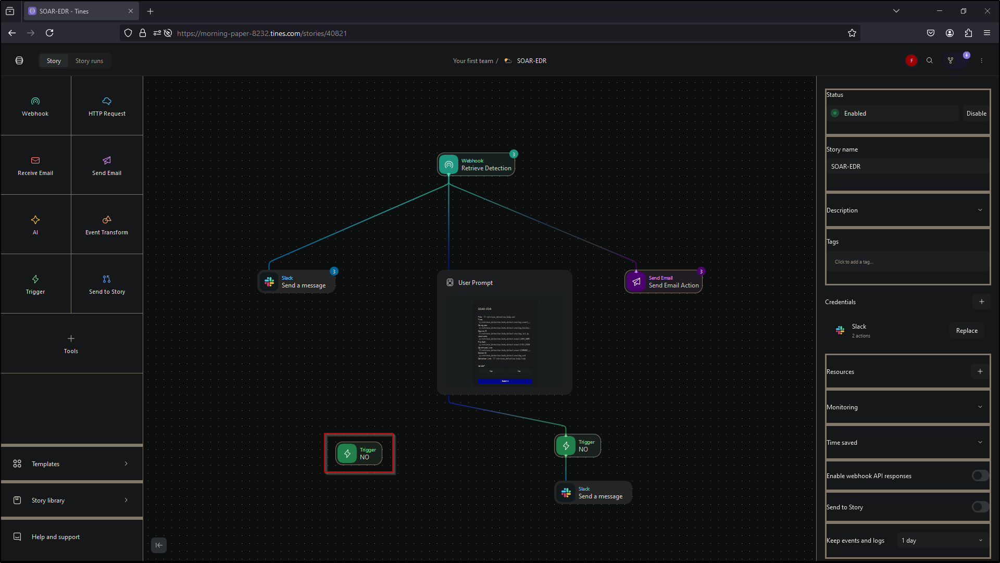
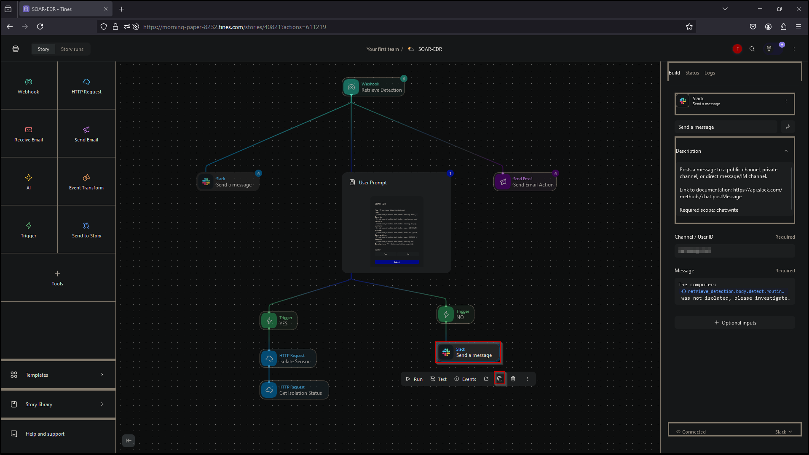

# 
 SOAR-EDR Project   Step-by-Step Implementation Guide

## Introduction
This document provides a comprehensive, step-by-step guide for deploying and configuring a Security Orchestration, Automation, and Response (SOAR) system integrated with Endpoint Detection and Response (EDR) using LimaCharlie, Slack, and Tines. The purpose of this guide is to help users implement a seamless detection and automated response workflow, enabling real-time monitoring, alerting, and machine isolation during potential security incidents.

The setup focuses on deploying a virtual environment, configuring the necessary EDR tools, generating telemetry, and integrating Slack for notifications and Tines for workflow automation. Each step is carefully outlined with detailed instructions and illustrations to ensure a successful implementation.

## Table of Contents

- [Part 1: Diagram (playbook workflow)](#Part-1-Diagram)
- [Part 2: Deploy Virtual server and setup LimaCharlie](#Part-2-Deploy-Virtual-server-and-setup-LimaCharlie)
- [Part 3: Telemetry](#Part-3-Telemetry)
- [Part 4: Salck & Tines](#Part-4-Salck-&-Tines)
- [Part 5: Automation](#Part-5-Automation)

## Step-by-Step Implementation Guide

### Part 1: Diagram
- Create playbook workflow
  - Send a Slack message containing information about the detection
  - Send an Email containing information about the detection
  - Generate a user prompt
    - Isolate the machine? (Yes/No)
    - If Yes – Isolate
   

 Create playbook workflow

### Part 2: Deploy Virtual server and setup LimaCharlie
- Deploy Virtual Server
- Install and setup LimaCharlie
- Confirm Events

 Deploy Server

 Select create Azure virtual machine

 Create new resource group 

 Enter name for virtual machine

 Select Region

 Select Image 

 Select virtual machine size

 Enter a username and password

 Select inbound ports and review and create

 Select Create

 RDP into new created vm

 Visit limacharlie.io and create account and then select Create Organization

 Create name for organization and select region then select Create Organization

 Select Installation Keys

 Select Create Installation Keys

 Enter description name and select create

 Remove all other installation keys 

 Select Windows 64 bit sensor download and paste in windows vm browser to download EDR

 Paste the link in URL and select enter to download

 Copy sensor key from LimaCharlie

 In windows vm open PowerShell as administrator

 Navigate to downloads directory

 Run the executable -i and paste our sensor key we copied and hit enter

 Navigate to services and search for LimaCharlie to verify successful installation

 Navigate back to LimaCharlie and select sensors list and verify our computer name is displayed

 Select the computer name and navigate to timeline to confirm LimaCharlie is generating events

### Part 3: Telemetry
- Generate telemetry (Lazagne)
- Create detection and response rule

 Generate telemetry (Lazagne-password recovery tool). Disable windows security to allow download

 Select Virus & threat protection

 Select manage settings

 Turn off real-time protection

 Navigate to LaZagne github and download the latest release 

 Select the file and allow download 

 View Downloads folder to verify download was successful 

 Open PowerShell from the Downloads directory by pressing shift and right click and selecting open PowerShell window here

 Run the lazagne executable to verify it works

 Navigate to LimaCharlie to see that it picked up the process

 Select the first NEW_PROCESS to open event view

 Next, create the detection and response rule. Select back to sensors 

 Navigate to Automation and select D&R Rules

 Select Create Custom Rule

 Create a detect and respond rule for lazagne

 Save the Rule

 Select Target Event to test the new rule

 Copy the entire NEW_PROCESS event for lazagne from the timeline and paste it in target event and select test event to test the new rule

 The new rule has successfully evaluated the 4 operations from the detect rules created

 Verify the detection is working. Navigate to the detection tab

 Select detection 

 Navigate back to windows vm and run lazagne all again

 Navigate back to LimaCharlie detection to verify (wait a few minutes and refresh the page to display)

### Part 4: Slack & Tines
- Setup Slack and Tines
- Test Connection (LimaCharlie & Tines)

 Create a new channel in slack named alerts

 Navigate to Tines and setup the link between LimaCharliie and Tines. Select Webhook and drag into story

 Enter name for webhook

 Enter description

 Copy the webhook URL 

 Navigate to LimaCharlie and select outputs

 Select add output

 Select detections

 Select Tines

 Enter name

 Enter the copied webhook URL from Tines in the Destination Host 

 Select save output

 Navigate to windows vm and execute lazagne to verify the SOAR-EDR configuration is working

 Navigate to LimaCharlie and select Refresh Samples to verify the detection has generated

 Navigate to Tines and select Events from the webhook

 Select the most recent detection

 Expand retrieve_detection

 Expand body to verify detection is displayed in Tines

### Part 5: Automation
- Create automation for playbook workflow
- Test the automation response for network isolation

 Navigate to Slack to create a link to Tines

 Select More 

 Select Automations

 Select Apps

 Search for Tines

 Select Add

 Select Add to Slack

 Navigate to tines and select Dashboard

 Select team

 Select Credentials

 Select New

 Select Slack

 Select use Tines app for Slack

 Select Allow

 Navigate back to story

 Select story

 Select Templates

 Select Slack

 Search for message

 Select Send a message

 Select Your first story and change the default name of story

 Select Dashboard 

 Select show story actions

 Select Move

 Select team

 Select Move

 Select Done

 Select team

 Select SOAR-EDR

 Select Slack

 Navigate to Slack to retrieve the Alerts channel ID

 Right click on alerts and select view channel details

 Copy the Channel ID

 Navigate to Tines and paste Channel ID in Channel/User ID

 Enter message to display

 Select Connect to Slack

 Select Slack

 Make a connection from the webhook to Slack

 Select Slack and select run to test

 Navigate to Slack and check alerts channel to verify connection is successful 

 Navigate to Tines and select Send Email and insert in story

 Connect Webhook to Send Email

 Select Send Email

 Enter Description

 Enter Email address

 Enter Sender Name

 Enter a Subject

 Select Test

 Select the most recent Retrieve Detection and select test

 Navigate to email inbox and verify email was sent 

 Navigate to Tines and select tools and insert page into story

 Enter Name

 Enter Description

 Enter Success message

 Link the Webhook to the User Prompt

 Select Edit page

 Select My new page 

 Enter name in contents

 Select the message to edit

 Enter message 

 Select Boolean and insert into User Prompt

 Select Slack

 Edit Message to include the details from our playbook diagram

 Select Test

 Select most recent Retrieve Detection and select test

 Navigate to Slack alerts channel to verify the message has been received

 Navigate to Tines and select Send Email

 Edit Body to include the details from our playbook diagram 

 Select Test

 Select most recent Retrieve Detection and select test

 Navigate to email inbox to verify email was received

 Select User Prompt 

 Select Edit

 Select the message and edit to include the details from our playbook diagram

 Select Boolean and edit 

 Select back

 Select Visit page to test

 Select most recent event

 Select No and select submit

 The submission was successful. Close this window 

 Select Trigger and insert into story

 Edit name

 Edit Description

 Link the User Prompt to Trigger NO

 Select rules to edit

 Delete the current rule

 Select user_prompt

 Select body

 Select isolate

 Edit is equal to false

 Copy the Slack message 

 Paste in story using ctrl-v

 Select new Slack message and edit the description

 Link the NO trigger to Slack

 Test the NO trigger. Select Webhook

 Select Events

 Select most recent event and select Re-emit

 Select User Prompt 

 Select visit page and select most recent event 

 Select No and select submit

 Close the window

 Navigate to Slack and verify the response 

 Navigate to Tines and copy the No Trigger

 Paste in story using ctrl-v

 Select Webhook 

 Select Events

 Select the most recent event and select Re-emit

 Select User Prompt

 Select visit page and select the most recent event

 Select Yes and Submit

 Close the window

 Select the copied No trigger

 Edit the Name

 Edit the Rules to is equal to true

 Link the Yes Trigger to the User Prompt

 Select Templates and search LimaCharlie

 Select LimaCharlie and Inset into the story

 Search isolate

 Select Isolate Sensor 

 Edit the URL to include the sid 

 Link the YES Trigger to the HTTP Request Isolate Sensor

 Navigate to LimaCharlie and select Access Management and select REST API

 Copy the Org JWT

 Navigate to Tines and select dashboard

 Select Credentials

 Select New and select Text

 Enter name 

 Enter Description

 Paste the Org JWT from LimaCharlie in Value

 Enter URLs and Domains 

 Select Save

 Navigate back to story

 Select Connect and select LimaCharlie

 Select Templates and search LimaCharlie

 Select LimaCharlie and insert into story

 Select Get Isolation Status

 Link the HTTP Request Isolate Sensor to HTTP Request Get Isolation Status

 Edit the URL for the HTTP Request for the Get Isolation Status to match our playbook

 Select Connect and select LimaCharlie 

 Select Slack and copy the send a message

 Paste in story using ctrl-v

 Link the HTTP Request Get Isolation message to the new Slack send a message

 Select Slack send a message and edit the message

 Navigate to LimaCharlie and verify Network Access is Allowed

 Navigate to Tines to test automated isolation. Select Webhook Retrieve Detection 

 Select Events 

 Select the most recent Event and select Re-emit

 Navigate to Slack to verify message has been received

 Select User Prompt

 Select Visit Page

 Select the most recent event

 Select Yes and Submit

 Close the window

 Navigate to Navigate to LimaCharlie to verify the network has been isolated

 Navigate to Slack and verify the status message was received

## Conclusion

By following this step-by-step implementation guide, this project successfully deployed and configured a robust SOAR-EDR system using LimaCharlie, Slack, and Tines. This system is now capable of detecting potential security threats in real-time, alerting relevant personnel, and automating critical response actions such as network isolation.

The integration of Slack for notifications and Tines for workflow automation allows for seamless communication and rapid response to incidents, reducing the need for manual intervention and improving overall efficiency. Additionally, the use of LimaCharlie’s detection and response rules ensures that suspicious activities, like those simulated with the LaZagne tool, are quickly identified and mitigated.
