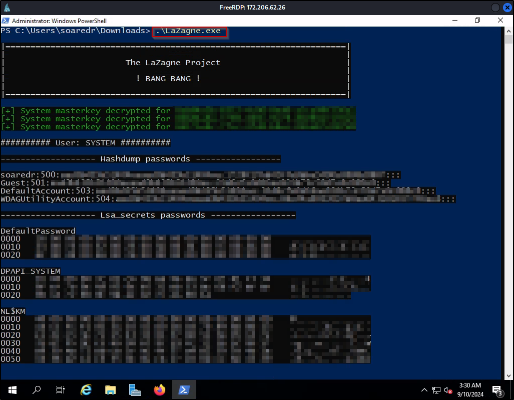
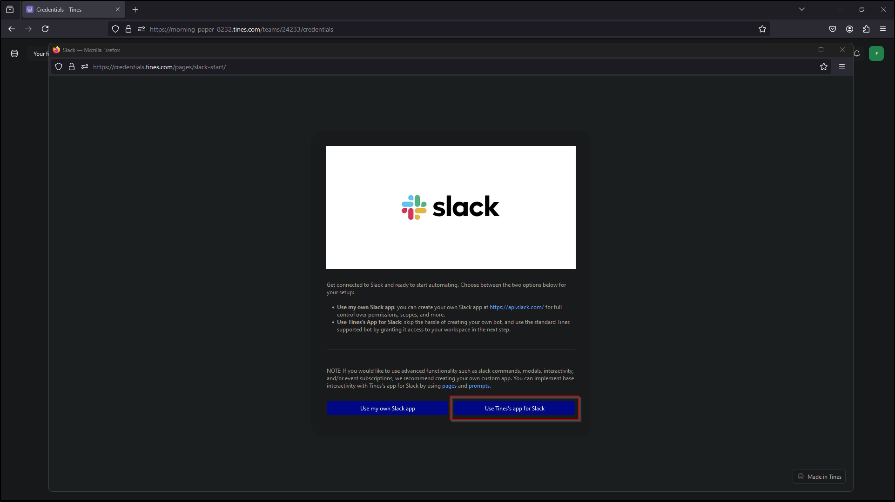
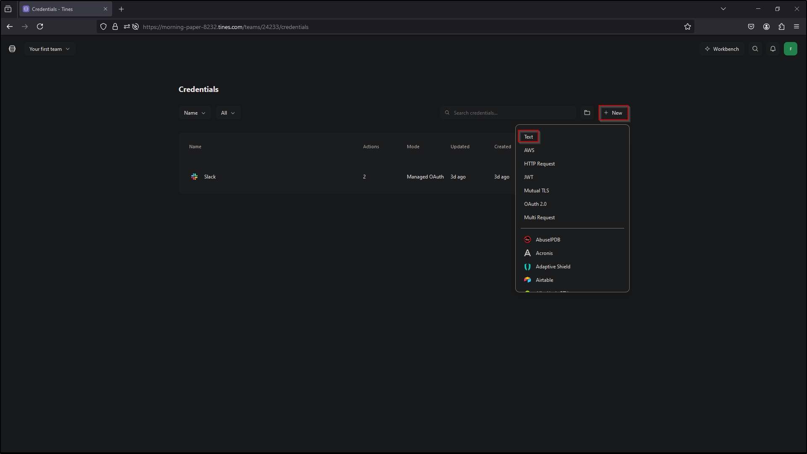

# 
 SOAR-EDR Project   Step-by-Step Implementation Guide

## Introduction
This document provides a comprehensive, step-by-step guide for deploying and configuring a Security Orchestration, Automation, and Response (SOAR) system integrated with Endpoint Detection and Response (EDR) using LimaCharlie, Slack, and Tines. The purpose of this guide is to help users implement a seamless detection and automated response workflow, enabling real-time monitoring, alerting, and machine isolation during potential security incidents.

The setup focuses on deploying a virtual environment, configuring the necessary EDR tools, generating telemetry, and integrating Slack for notifications and Tines for workflow automation. Each step is carefully outlined with detailed instructions and illustrations to ensure a successful implementation.

## Table of Contents

- Part 1: Diagram (playbook workflow)
- Part 2: LimaCharlie
- Part 3: Telemetry
- Part 4: Salck & Tines
- Part 5: Automation

## Step-by-Step Implementation Guide

### Step 1: Diagram
- Create playbook workflow
  - Send a Slack message containing information about the detection
  - Send an Email containing information about the detection
  - Generate a user prompt
    - Isolate the machine? (Yes/No)
    - If Yes – Isolate
   
Create playbook workflow

### Step 2: Deploy Virtual server and setup LimaCharlie

Deploy Server

Select create Azure virtual machine

Create new resource group 

Enter name for virtual machine

Select Region

Select Image 

Select virtual machine size

Enter a username and password

Select inbound ports and review and create

Select Create

RDP into new created vm

Visit limacharlie.io and create account and then select Create Organization

Create name for organization and select region then select Create Organization

Select Installation Keys

Select Create Installation Keys

Enter description name and select create

Remove all other installation keys 

Select Windows 64 bit sensor download and paste in windows vm browser to download EDR

Paste the link in URL and select enter to download

Copy sensor key from LimaCharlie

In windows vm open PowerShell as administrator

Navigate to downloads directory

Next, we will run the executable -i and paste our sensor key we copied and hit enter

Head over to services and search for LimaCharlie to verify successful installation

Navigate back to LimaCharlie and select sensors list and verify our computer name is displayed

Select the computer name and navigate to timeline to confirm LimaCharlie is generating events

### Step 3: Telemetry

Generate telemetry (Lazagne-password recovery tool). We need to disable windows security to allow us to download

Select Virus & threat protection

Select manage settings

Turn off real-time protection

Navigate to LaZagne github and download the latest release 

Select the file and allow download 

View Downloads folder to verify download was successful 

Open PowerShell from the Downloads directory by pressing shift and right click and selecting open PowerShell window here

Run the lazagne executable to verify it works

Navigate to LimaCharlie to see that it picked up the process

Select the first NEW_PROCESS to open event view

Next, create the detection and response rule. Select back to sensors 

Navigate to Automation and select D&R Rules

Select Create Custom Rule

Create a detect and respond rule for lazagne

Save the Rule

Select Target Event to test the new rule

Copy the entire NEW_PROCESS event for lazagne from the timeline and paste it in target event and select test event to test the new rule

The new rule has successfully evaluated the 4 operations from the detect rules created

Verify the detection is working. Navigate to the detection tab

Select detection 

Navigate back to windows vm and run lazagne all again

Navigate back to LimaCharlie detection to verify (wait a few minutes and refresh the page to display)

### Step 4: Slack & Tines

Create a new channel in slack named alerts

Navigate to Tines and setup the link between LimaCharliie and Tines. Select Webhook and drag into story

Enter name for webhook

Enter description

Copy the webhook URL 

Navigate to LimaCharlie and select outputs

Select add output

Select detections

Select Tines

Enter name

Enter the copied webhook URL from Tines in the Destination Host 

Select save output

Navigate to windows vm and execute lazagne to verify the SOAR-EDR configuration is working

Navigate to LimaCharlie and select Refresh Samples to verify the detection has generated

Navigate to Tines and select Events from the webhook

Select the most recent detection

Expand retrieve_detection

Expand body to verify detection is displayed in Tines

### Step 5: Automation

Navigate to Slack to create a link to Tines

Select More 

Select Automations

Select Apps

Search for Tines

Select Add

Select Add to Slack

Navigate to tines and select Dashboard

Select team

Select Credentials

Select New

Select Slack

Select use Tines app for Slack

Select Allow

Navigate back to story

Select story

Select Templates

Select Slack

Search for message

Select Send a message

Select Your first story and change the default name of story

Select Dashboard 

Select show story actions

Select Move

Select team

Select Move

Select Done

Select team

Select SOAR-EDR

Select Slack

Navigate to Slack to retrieve the Alerts channel ID

Right click on alerts and select view channel details

Copy the Channel ID

Navigate to Tines and paste Channel ID in Channel/User ID

Enter message to display

Select Connect to Slack

Select Slack

Make a connection from the webhook to Slack

Select Slack and select run to test

Navigate to Slack and check alerts channel to verify connection is successful 

Navigate to Tines and select Send Email and insert in story

Connect Webhook to Send Email

Select Send Email

Enter Description

Enter Email address

Enter Sender Name

Enter a Subject

Select Test

Select the most recent Retrieve Detection and select test

Navigate to email inbox and verify email was sent 

Navigate to Tines and select tools and insert page into story

Enter Name

Enter Description

Enter Success message

Link the Webhook to the User Prompt

Select Edit page

Select My new page 

Enter name in contents

Select the message to edit

Enter message 

Select Boolean and insert into User Prompt

Select Slack

Edit Message to include the details from our playbook diagram

Select Test

Select most recent Retrieve Detection and select test

Navigate to Slack alerts channel to verify the message has been received

Navigate to Tines and select Send Email

Edit Body to include the details from our playbook diagram 

Select Test

Select most recent Retrieve Detection and select test

Navigate to email inbox to verify email was received

Select User Prompt 

Select Edit

Select the message and edit to include the details from our playbook diagram

Select Boolean and edit 

Select back

Select Visit page to test

Select most recent event

Select No and select submit

The submission was successful. Close this window 

Select Trigger and insert into story

Edit name

Edit Description

Link the User Prompt to Trigger NO

Select rules to edit

Delete the current rule

Select user_prompt

Select body

Select isolate

Edit is equal to false

Copy the Slack message 

Paste in story using ctrl-v

Select new Slack message and edit the description

Link the NO trigger to Slack

Test the NO trigger. Select Webhook

Select Events

Select most recent event and select Re-emit

Select User Prompt 

Select visit page and select most recent event 

Select No and select submit

Close the window

Navigate to Slack and verify the response 

Navigate to Tines and copy the No Trigger

Paste in story using ctrl-v

Select Webhook 

Select Events

Select the most recent event and select Re-emit

Select User Prompt

Select visit page and select the most recent event

Select Yes and Submit

Close the window

Select the copied No trigger

Edit the Name

Edit the Rules to is equal to true

Link the Yes Trigger to the User Prompt

Select Templates and search LimaCharlie

Select LimaCharlie and Inset into the story

Search isolate

Select Isolate Sensor 

Edit the URL to include the sid 

Link the YES Trigger to the HTTP Request Isolate Sensor

Navigate to LimaCharlie and select Access Management and select REST API

Copy the Org JWT

Navigate to Tines and select dashboard

Select Credentials

Select New and select Text

Enter name 

Enter Description

Paste the Org JWT from LimaCharlie in Value

Enter URLs and Domains 

Select Save

Navigate back to story

Select Connect and select LimaCharlie

Select Templates and search LimaCharlie

Select LimaCharlie and insert into story

Select Get Isolation Status

Link the HTTP Request Isolate Sensor to HTTP Request Get Isolation Status

Edit the URL for the HTTP Request for the Get Isolation Status to match our playbook

Select Connect and select LimaCharlie 

Select Slack and copy the send a message

Paste in story using ctrl-v

Link the HTTP Request Get Isolation message to the new Slack send a message

Select Slack send a message and edit the message

Navigate to LimaCharlie and verify Network Access is Allowed

Navigate to Tines to test automated isolation. Select Webhook Retrieve Detection 

Select Events 

Select the most recent Event and select Re-emit

Navigate to Slack to verify message has been received

Select User Prompt

Select Visit Page

Select the most recent event

Select Yes and Submit

Close the window

Navigate to Navigate to LimaCharlie to verify the network has been isolated

Navigate to Slack and verify the status message was received

